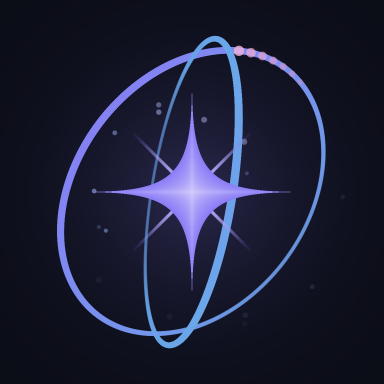

<p align="center">
  
</p>

# Celestia AI

> Tu propia IA personal. Vive en tu dispositivo, recuerda lo que importa,
> aprende habilidades nuevas en vivo y ejecuta tareas reales en tu nombre.

[]() []() []() []()

---

## ¿Qué es Celestia?

Celestia es un **agente personal de IA** que conversas por WhatsApp como si
fuera una persona. Te responde con voz natural en tiempo real, recuerda
detalles entre sesiones, ve fotos que le mandas, genera documentos, controla
tu móvil cuando se lo pides, y aprende habilidades nuevas en vivo cuando le
falta una.

Lo diferente: **todo lo personal se queda en tu dispositivo**. Ni
historial en la nube de OpenAI, ni "tus chats entrenan modelos ajenos", ni
servidores externos custodiando tus datos. Celestia corre en tu Android (o PC)
y las API que usa son intercambiables. Para que nunca se quede muda por un
rate-limit, encadena varios proveedores gratuitos en orden de velocidad y
calidad — **Groq → Cerebras → Gemini → GitHub Models → OpenRouter → Qwen
local** — degradando con elegancia hasta la red de seguridad offline.

Lo otro diferente: **no se inventa cosas**. Cuando no sabe algo, lo dice. Cuando
algo le toma tiempo, lo dice. Cuando hace falta root o un permiso, lo dice.
Esto suena obvio hasta que pruebas otros asistentes.

## En 60 segundos

```bash
# 1. Clona y entra
git clone <repo> celestia && cd celestia

# 2. Bootstrap automático (detecta tu plataforma)
bash scripts/bootstrap.sh

# 3. Edita .env y pon tu GROQ_API_KEY (gratis en console.groq.com/keys)
nano .env

# 4. Arranca
bash arrancar.sh     # lanzador robusto: API + bridge, idempotente y auto-reparable
# make run           # alternativa PC/Linux
# En Android: pulsa el widget Termux:Widget "CelestiaGPU"
```

`arrancar.sh` es el lanzador recomendado para el día a día: carga el `.env`
(con toda la cadena de proveedores y la zona horaria), levanta la API y el
bridge solo si hacen falta, y se puede reusar tras un corte:

```bash
bash arrancar.sh            # arranca/repara lo que esté caído (idempotente)
bash arrancar.sh estado     # panel de salud, no toca nada
bash arrancar.sh reiniciar  # reinicio limpio de API + bridge
bash arrancar.sh parar      # detiene ambos
```

A los ~50 segundos verás el banner:

```
  WhatsApp API lista en http://localhost:8765
  STT Whisper : ✓
  TTS edge-tts: ✓
  Visión      : ✓ via Groq vision (llama-4-scout)
  Groq        : ✓ (llama-3.3-70b-versatile)
  OpenRouter  : ✓ (fallback)
```

Y para hablar con ella, dos chats:

```bash
python3 hablar.py                    # en el terminal (Termux): el orbe te saluda girando
```
```
http://127.0.0.1:8765/chat           # en el navegador: mismo logo, en canvas e interactivo
```

En los dos, el logo **no es un adorno**: cambia de color y de velocidad con lo
que Celestia está haciendo de verdad — recordando, buscando, leyendo,
escribiendo — porque lee `/actividad`, que publica el propio orquestador.

Mira la conversación real en [`examples/`](./examples/) — texto, voz, imágenes,
documentos, aprendizaje en vivo, asistente de salud.

## Instalación con pip (extras)

El núcleo arranca con dependencias mínimas (Flask + cripto + numpy); todo lo
pesado es opcional. Instala solo lo que necesites:

```bash
pip install .              # núcleo: API + vault + memoria básica (cae a Groq/OpenRouter)
pip install '.[gpu]'       # torch/transformers/faiss/sentence-transformers (inferencia local)
pip install '.[voice]'     # STT (faster-whisper) + TTS (edge-tts)
pip install '.[whatsapp]'  # modo WhatsApp completo (API + voz)
pip install '.[local]'     # llama-cpp-python (inferencia CPU/ARM en Termux)
pip install '.[docs]'      # generación de PDF/DOCX/MD
pip install '.[dev]'       # pytest, coverage, ruff, mypy
```

La versión es única (`celestia_lib.__version__`); `celestia --version` la muestra.

## Observabilidad

Variables de entorno opcionales (en `.env`) para producción:

| Variable | Efecto |
|---|---|
| `LOG_FORMAT=json` | Logs estructurados en JSON (uno por línea) en vez de texto plano — ideal para agregadores tipo Loki/CloudWatch. Por defecto `text`. |
| `SENTRY_DSN=https://…` | Si está definido, los errores no controlados se reportan a Sentry con el `request_id` de contexto. Requiere `pip install sentry-sdk`. |
| `SENTRY_ENV=production` | Etiqueta de entorno para Sentry (default `production`). |
| `CELESTIA_API_TOKEN=…` | Exige header `X-Celestia-Token` en los endpoints HTTP. Vacío = abierto (modo legacy). |

## Qué hace hoy

| Capacidad | Detalle |
|---|---|
| 🗣️ **Voz multilingual** | 40+ voces edge-tts. Cambia idioma/acento/género/velocidad por lenguaje natural ("habla en inglés con voz argentina") |
| 🧠 **Memoria persistente real** | SQLite + FAISS + FTS5. Recuerda conversaciones entre sesiones, no se inventa lo que no sabe. Memoria personal **con vigencia temporal**: maneja datos que cambian ("antes vivía en X, ahora en Y") sin perder el historial ni acumular contradicciones |
| 👁️ **Visión** | Analiza imágenes/screenshots vía Groq vision (llama-4-scout) o Qwen2-VL local |
| 🎤 **STT con Whisper** | Transcribe notas de voz al instante; opcional para llamadas largas en `/transcribir_llamada` |
| 🛠️ **Aprende habilidades** | Cuando no sabe algo, busca en internet, genera código, lo prueba y corrige. Las skills aprendidas quedan en `skills/` |
| 📄 **Genera documentos** | PDF, DOCX, TXT, MD, HTML, CSV, JSON + código en 20+ lenguajes |
| 🏗️ **Proyectos multi-archivo** | "Hazme un mod de Roblox" / "una web React de notas" → ZIP con la estructura correcta. 16 perfiles de plataforma |
| 📱 **Agente UI cross-platform** | Opera apps móviles (Android UI Automator), Windows (pywinauto), Linux/macOS (OCR + pyautogui) |
| 🔐 **Vault de contraseñas** | AES-256 (Fernet) + Argon2id + 2FA real (contraseña maestra + secreto aleatorio en USB) |
| 🏥 **Asistente de salud** | Recordatorios de medicación, registro de síntomas, hábitos |
| 🤔 **Auto-reflexión** | Cada 6h analiza qué hizo bien/mal y lo persiste; puedes preguntarle "qué fallaste hoy" |
| ⏰ **Wake word** | "Hey Celestia" + endpoint `/wake_check` (requiere mic en Termux) |
| ✦ **Chat web propio** | `/chat` — una página sin dependencias externas (ni CDN ni fuentes remotas: Celestia vive en un móvil y a veces sin datos). Logo interactivo en canvas, tema noche/amanecer, hilo que sobrevive a la recarga |
| 🌀 **El orbe** | Logo propio definido en geometría 3D y proyectado en cada fotograma: braille en el terminal, canvas en la web y PNG con `scripts/render_logo.py`. Las tres salidas son la misma figura |

## Arquitectura

```
┌─────────────────────────────────────────────────────────────────┐
│  Tu dispositivo (Android / Linux / Mac)                         │
│                                                                  │
│   ┌──────────────────┐  HTTP  ┌────────────────────┐            │
│   │  celestia.py     │ ─────► │  bridge.js (8765)  │            │
│   │  (Flask :8765)   │ ◄───── │  Baileys WhatsApp  │ ◄──► WhatsApp
│   │                  │ :8766  │  Web client        │            │
│   │  ┌──────────┐    │  proac.└──────────┬─────────┘            │
│   │  │ Memory   │    │                                          │
│   │  │ (SQLite  │    │                                          │
│   │  │ +FAISS)  │    │                                          │
│   │  └──────────┘    │                                          │
│   └────────┬─────────┘                                          │
│            │                                                    │
│   ┌───────────────────────────────────────────────────────┐     │
│   │ Modelos (fallback en cascada):                        │     │
│   │ Groq→Cerebras→Gemini→GitHub→OpenRouter→Qwen local     │     │
│   └───────────────────────────────────────────────────────┘     │
└─────────────────────────────────────────────────────────────────┘
```

Detalles en [`ARCHITECTURE.md`](./ARCHITECTURE.md). Decisiones técnicas en
[`docs/adr/`](./docs/adr/). Performance medido en
[`docs/performance.md`](./docs/performance.md).

## Filosofía (lo que NO cambiará)

1. **Solo actúa bajo orden explícita** del usuario. Nada de iniciativa propia.
2. **Privacidad total**: los datos personales nunca salen del dispositivo.
3. **Honestidad sobre limitaciones**: si no puede hacer algo, lo dice — no
   pretende que está "analizando opciones".
4. **Consentimiento explícito** para cualquier acción destructiva.
5. **Degradación elegante**: la mejor experiencia posible con los recursos
   disponibles (móvil sin GPU, PC con GPU, offline puro).

## Estado actual

**Versión**: v1.5.1 (mayo 2026) — uso personal del autor.
**Demo-ready**: sí, para mostrar a colaboradores/early adopters.
**Production-ready**: faltan piezas (refactor del WhatsAppAPI, sandbox bwrap,
multi-tenancy). Ver [`ROADMAP.md`](./ROADMAP.md).

## Roadmap

Fases 1, 2 y partes de 3 ✓. Pendiente: wake word remoto vía Raspberry Pi,
federated learning, multi-canal (Telegram + dashboard web interactivo),
monetización (Celestia Cloud / Local). Detalles en
[`ROADMAP.md`](./ROADMAP.md).

## Tests

```bash
make test               # 80 tests pasando
make test-fast          # sin verbose
make check              # sintaxis + tests rápido (pre-commit)
```

Cobertura medida actual: **~20%** (objetivo v2: 60%). El grueso de tests
cubre módulos extraídos en `celestia_lib/`: regex, memoria, fallback chain,
sandbox de skills, integración SQLite real.

## Contribuir

Lee [`CONTRIBUTING.md`](./CONTRIBUTING.md). El proyecto está en migración
del monolito original a `celestia_lib/` (paquete con 13 módulos). Si tocas
una clase grande mira [`REFACTOR_PLAN.md`](./REFACTOR_PLAN.md) por si ya
está en el plan de extracción.

## Licencia

[`LICENSE`](./LICENSE) — All Rights Reserved (durante alfa). Plan de
relicenciamiento a MIT/Apache 2.0 con v1.0 estable.

Para colaboraciones, prensa o licencias comerciales: contacto en el
copyright holder del LICENSE.
